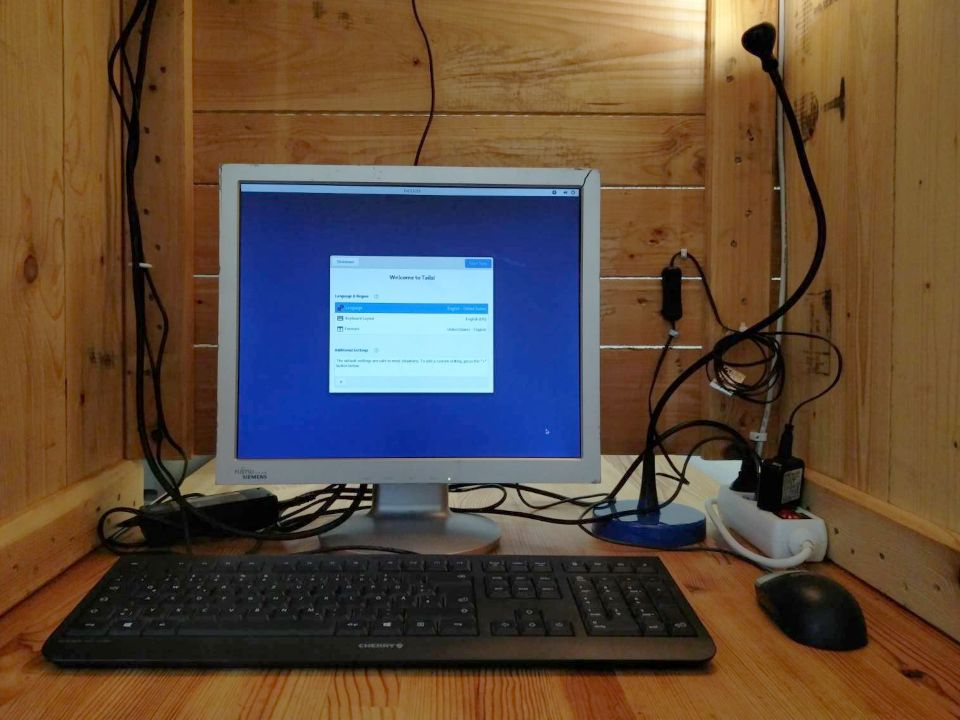
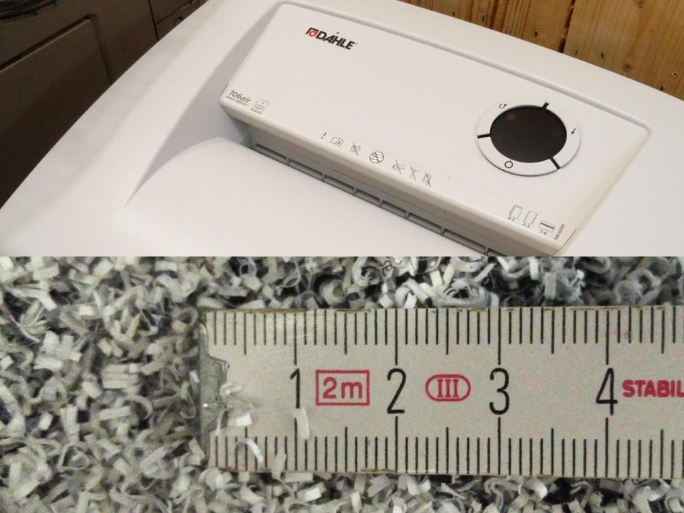
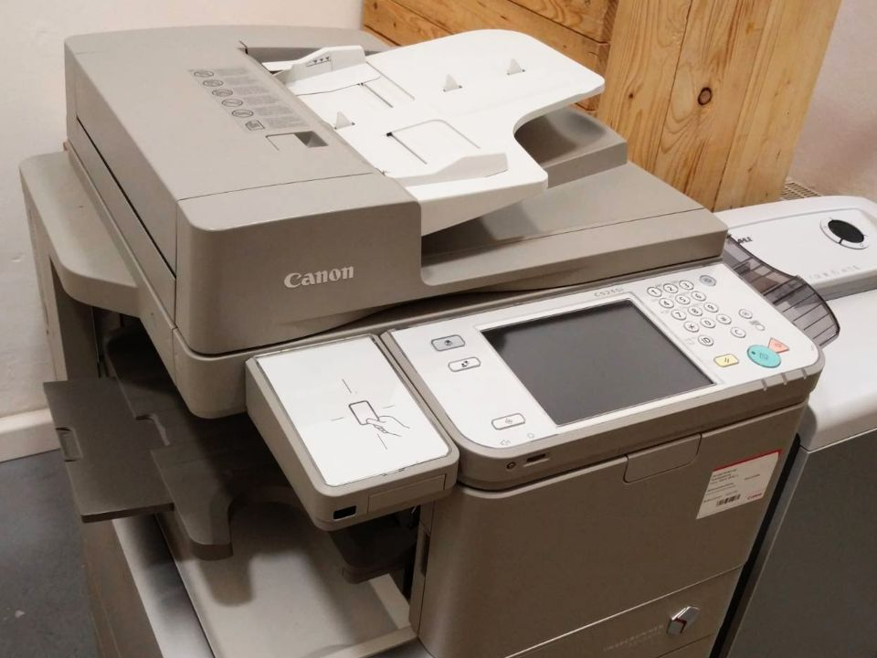

<h1 class="text-center">ProxyStore</h1>

Bernhard-Göring-Straße 162, 04277 Leipzig, Germany

Opening hours: Mon+Thu 10am-6pm, Tue+Wed+Fri+Sat 10am-2pm and by arrangement

## Products from our online shops

Our range of [digital goods](https://digitalgoods.proxysto.re) and products from our online shops [shop.proxysto.re](https://shop.proxysto.re) and [toolbox77.de](https://toolbox77.de) are fully available in our local store.

## Books and brochures

In addition to some brochures on data security and digital self-defense, we also have [a small range of books in stock](https://shop.proxysto.re/category/7). For every book you buy directly from us, we donate five percent of the book price to a total of five selected projects. The projects will be selected for a minimum of three months. The donations (one percent for each project) will be transferred every three months and published here. The current project selection: [Archive.org](https://archive.org/donate), [Qubes OS](https://www.qubes-os.org/donate/), [SciHub](https://de.wikipedia.org/wiki/Sci-Hub), [Tails](https://tails.boum.org/donate/index.de.html), [Whonix](https://www.whonix.org/wiki/Donate).

## Devices

You can use these devices free of charge or for a small fee during our opening hours:

	

		

			
			

				<h3 class="card-title">Tails Computer</h3>
				
This Computer has no hard drive. It's booting the <a href="https://tails.boum.org/">Tails</a> operating system from a DVD, allowing you to move anonymously on the Internet. A cabin protects you from prying eyes.

			

		

	

	

		

			
			

				<h3 class="card-title">Shredder</h3>
				
The Dahle 706air with security levels P-7/F-3/T-6 shreds paper and plastic cards cards into millimeter-small shreds. If that is not enough for you, you can bring a bag and take the scraps with you.

			

		

	

	

		

			
			

				<h3 class="card-title">Multi-function Printer</h3>
				
Prints, scans and copies A3 and A4, black and white and color. You can attach an USB stick or connect it to the Tails computer.

			

		

	

<!--
<a href="http://digitazyyxyihwwzudp5syxxyn3qhcd63wqcha2dxpfqiyydmrgdiaad.onion/">onion</a>
<a href="http://proxyoxiemywllckvpix543gqcmvvltrnb7inbwtk2knkehqt72tyfyd.onion">onion</a>
<a href="http://print5cxveagitd3cbl3pakcjupk5jwgtpwa35uowhtzlmcqbibmsnyd.onion">onion</a>
-->
