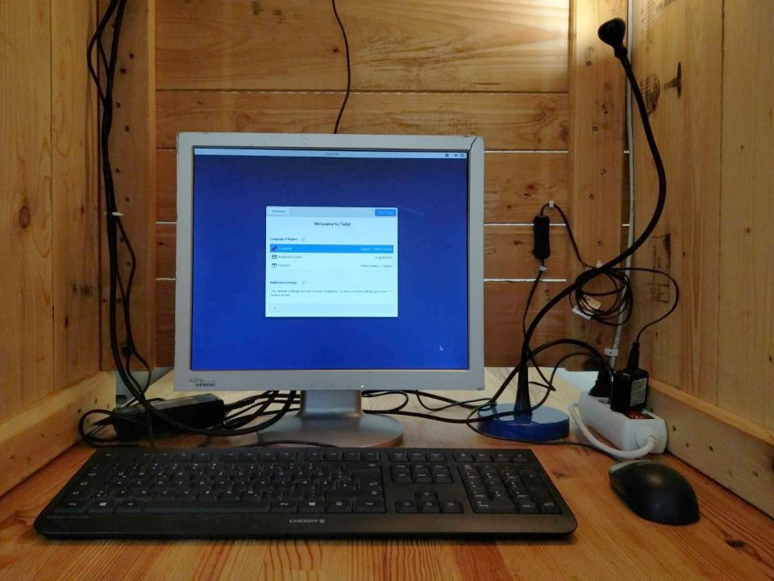
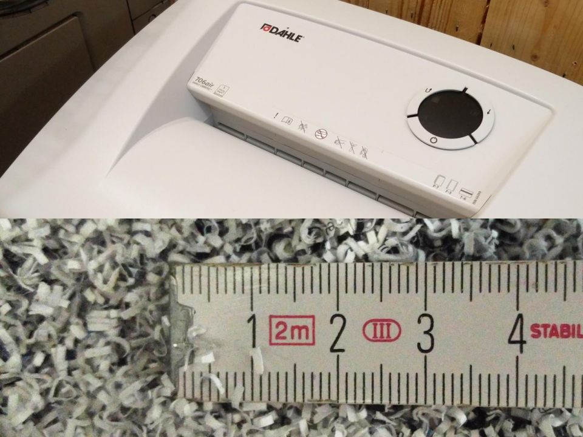
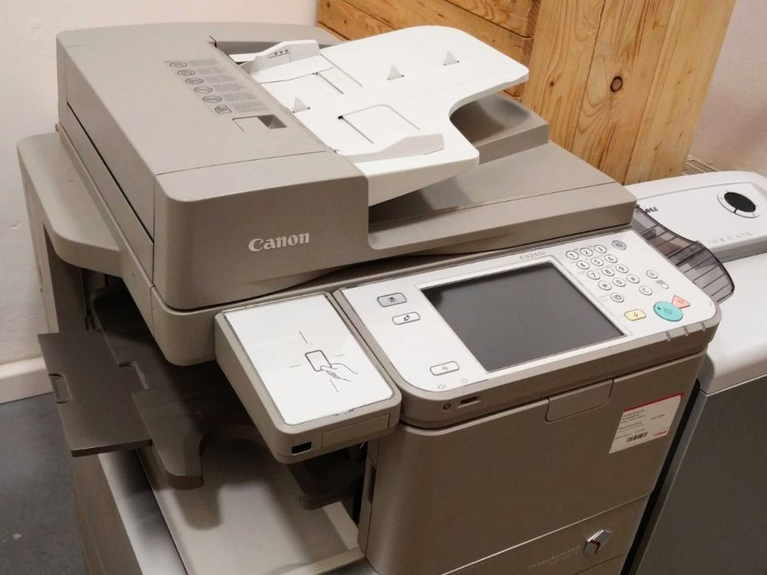

# Ladengeschäft

Bernhard-Göring-Straße 162, 04277 Leipzig &ndash; Öffnungszeiten: <strong>Mo+Do 10-18 Uhr, Di+Mi+Fr+Sa 10-14 Uhr</strong> und nach Vereinbarung

## Analoger und digitaler Datenschutz

- [Mullvad VPN](https://mullvad.net/de/) Guthabenkarten
  - 1 Monat: 5 €
  - 6 Monate: 30 €
  - 12 Monate: 60 €
- [Tutanota – sichere E-Mails für jeden!](https://tutanota.com/de/) Gutscheinkarten
- [Cryptomator](https://cryptomator.org/)
  - Android-Lizenz: 9,99 €
  - Supporter-Zertifikat: 15 €
- [Koofr Cloud Storage](https://koofr.eu/) 12 Monate
  - 25 GB: 12 €
  - 100 GB: 24 €
  - 250 GB: 48 €
  - 1 TB: 120 €
- USB Data Blocker: 4 €
- Microphone Blocker: 3 €
- Kameracover verschiebbar, schwarz: 1 €
- Kameracover Aufkleber 12 mm, schwarz: gegen Spende
- RFID/NFC Block Hüllen: 1 €
- RFID/NFC Block Karten: 2,50 €
- [Faraday Bags von FWR](https://faraday-bags.de/) in verschiedenen Größen und Ausführungen

## Bücher und Broschüren

Neben einigen Broschüren zu Datensicherheit und digitaler Selbstverteidigung haben wir auch ein kleines Büchersortiment vorrätig, überwiegend von den Verlagen mitp und Rheinwerk. Welche das sind, könnt ihr zunächst in unserem [booklooker-Account](https://www.booklooker.de/B%C3%BCcher/Angebote/showAlluID=6790462) sehen. Demnächst wird es auch möglich sein, diese und weitere Bücher über unser Bestellsystem zu bestellen.

Darüber hinaus steht euch durch unsere Kooperation mit der Buchhandlung [el libro](https://www.genialokal.de/buchhandlung/leipzig/el-libro/) das gesamte dortige Sortiment zur Verfügung.

Für jedes Buch, das ihr direkt bei uns kauft, spenden wir fünf Prozent des Buchpreises an insgesamt fünf ausgewählte Projekte. Die Projektauswahl erfolgt für mindestens drei Monate. Die Spenden (jeweils ein Prozent für jedes Projekt) werden alle drei Monate übermittelt und [hier veröffentlicht](spendenverlauf.html).

Die aktuelle Projektauswahl: [Archive.org](https://archive.org/donate), [Qubes OS](https://www.qubes-os.org/donate/), [SciHub](https://de.wikipedia.org/wiki/Sci-Hub), [Tails](https://tails.boum.org/donate/index.de.html), [Whonix](https://www.whonix.org/wiki/Donate)

Alternativ könnt ihr natürlich auch über unseren [Bestellservice](bestellservice.html) beim Online-Buchhandel eurer Wahl einkaufen.

## Geräte

Während unserer Öffnungszeiten könnt ihr kostenfrei oder gegen einen geringen Betrag diese Geräte nutzen:

	

		

			
			

				<h3 class="card-title">Tails-Computer</h3>
				
Dieser Computer hat keine Festplatte. Auf ihm startet das Betriebssystem <a href="https://tails.boum.org/">Tails</a> von einer DVD. Damit kannst du dich anonym im Internet bewegen. Eine Kabine schützt dich dabei vor neugierigen Blicken.

			

		

	

	

		

			
			

				<h3 class="card-title">Aktenvernichter</h3>
				
Der Dahle 706air mit Sicherheitsstufen P-7/F-3/T-6 zerkleinert Papier und Plastik&shy;karten in millimeterkleine Schnipsel. Falls dir das nicht reicht, kannst du einen Beutel mitbringen und die Reste mitnehmen.

			

		

	

	

		

			
			

				<h3 class="card-title">Kopierer</h3>
				
Druckt, scannt und kopiert DIN A3 und A4, schwarz-weiß und in Farbe. Du kannst einen USB-Stick anschließen oder ihn mit dem Tails-Computer verbinden.

			

		

	

